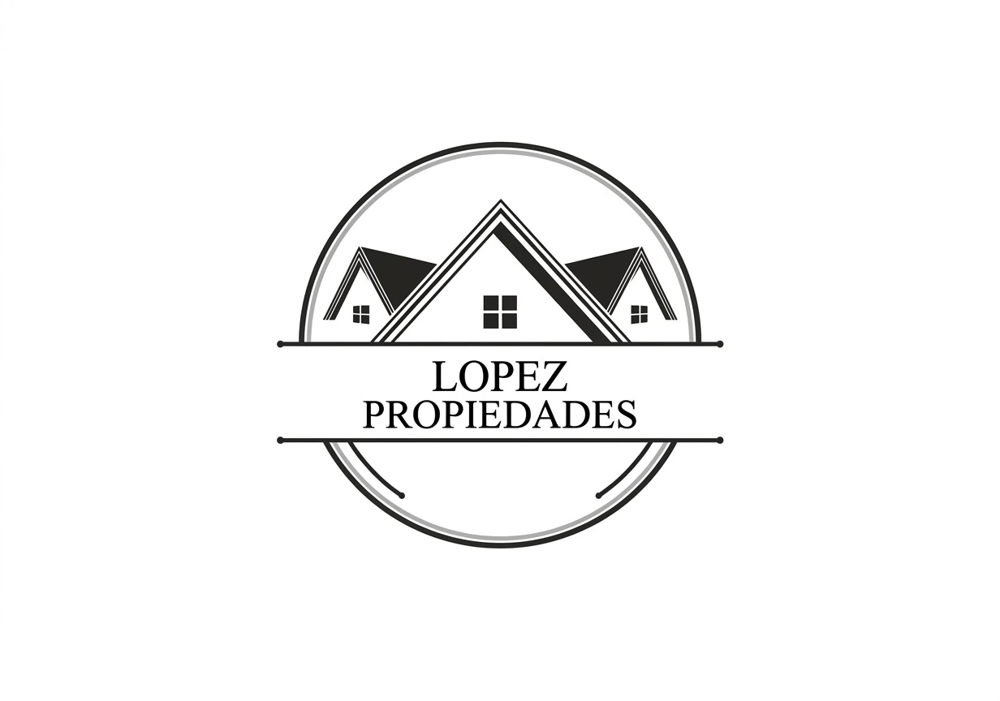
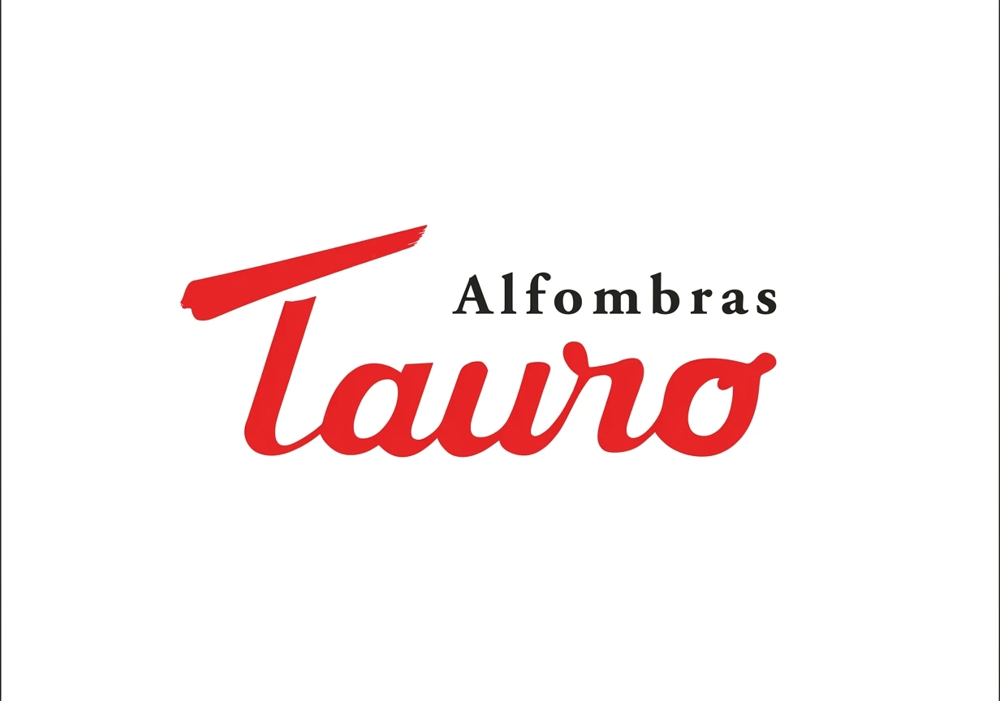
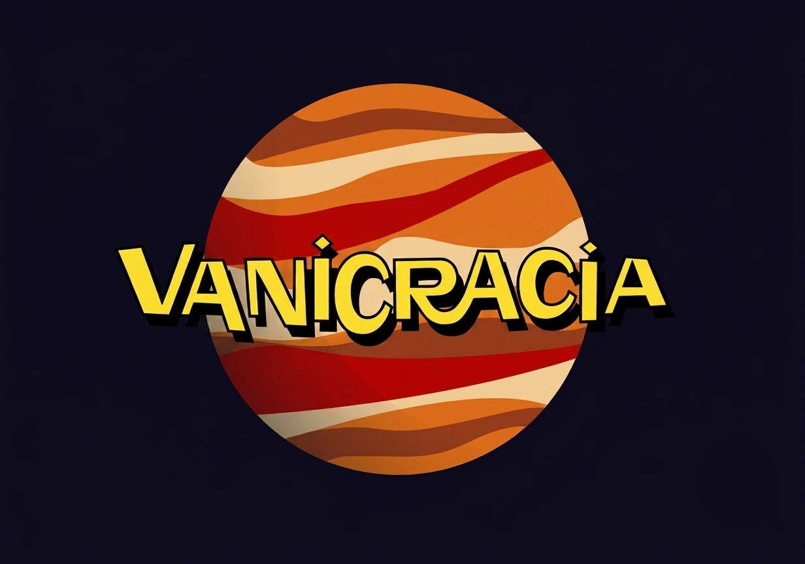

 

  

 

<pre style="background:#0d1117; color:#e6edf3; padding:20px 24px; border-radius:16px; border:1px solid #30363d; display:block; font-family:'Fira Code', monospace; font-size:18px; line-height:1.6; box-shadow: 0 8px 32px rgba(0,0,0,0.45); margin-left:0;">
<code style="font-family:inherit; font-size:18px;">{
  "name": "Damián Rodríguez",
  "role": "Frontend Developer",
  "location": "Buenos Aires, Argentina",
  "experience": "2+ años",
  "philosophy": "Construir interfaces a medida, únicas y pulidas hasta el último detalle",
  "coreTechs": ["React", "Next.js", "TypeScript", "React Native", "Tailwind CSS", "GSAP", "Framer Motion"]
}</code>
</pre>

  

  

 

 

  

  

 

<table width="100%" cellpadding="0" cellspacing="0">
  <tr>
    <td align="center" valign="top" width="23%" bgcolor="#262626" style="border-radius:8px; overflow:hidden;">
      <a href="https://www.loppezinmobiliaria.com/" style="color:#F2F2F2; text-decoration:none;">
         
        <table width="100%" cellpadding="12" cellspacing="0"><tr><td align="center"><strong>Lopez Propiedades</strong> 
        Plataforma web inmobiliaria</td></tr></table>
      </a>
    </td>
    <td width="2%">&nbsp;</td>
    <td align="center" valign="top" width="23%" bgcolor="#262626" style="border-radius:8px; overflow:hidden;">
      <a href="https://github.com/DamRodriguez/spotify-mobile" style="color:#F2F2F2; text-decoration:none;">
         
        <table width="100%" cellpadding="12" cellspacing="0"><tr><td align="center"><strong>Spotify Mobile</strong> 
        Clón móvil de Spotify</td></tr></table>
      </a>
    </td>
    <td width="2%">&nbsp;</td>
    <td align="center" valign="top" width="23%" bgcolor="#262626" style="border-radius:8px; overflow:hidden;">
      <a href="https://alfombrastauro.com/" style="color:#F2F2F2; text-decoration:none;">
         
        <table width="100%" cellpadding="12" cellspacing="0"><tr><td align="center"><strong>Alfombras Tauro</strong> 
        Plataforma web corporativa</td></tr></table>
      </a>
    </td>
    <td width="2%">&nbsp;</td>
    <td align="center" valign="top" width="23%" bgcolor="#262626" style="border-radius:8px; overflow:hidden;">
      <a href="https://vanicracia.com/" style="color:#F2F2F2; text-decoration:none;">
         
        <table width="100%" cellpadding="12" cellspacing="0"><tr><td align="center"><strong>Vanicracia</strong> 
        E-commerce de astrología</td></tr></table>
      </a>
    </td>
  </tr>
</table>

  

  

 

  

 

  

  

  

 

  

